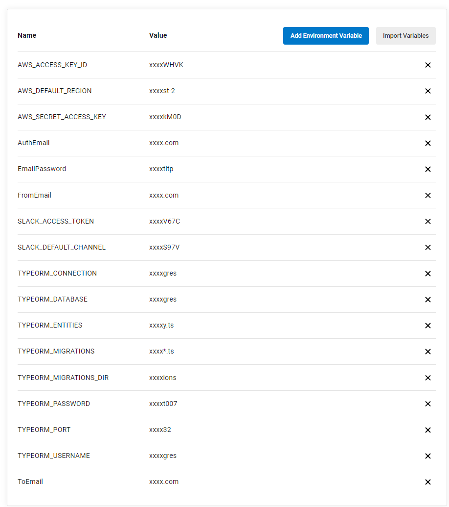
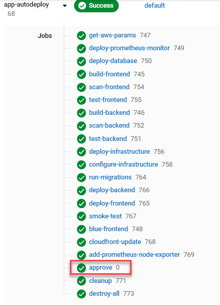

## A complete CI/CD project

This project executes the following:

- Sets up a complete blue deployment with infrastructure including:
  - Static website deployed in an S3 bucket
  - Cloudfront pointing to the static website
- Creates a green deployment with the following infrastructure:
  - S3 website frontend
  - EC2 backend with NodeJS
  - Postgres Database
- Integration tests with:
  - Slack integration
  - Frontend and backend smoke testing
- Sets up centralised structured logging and diagnosis with:
  - Prometheus for monitoring
  - Gmail for automated notifications

Blue-green deployment happens after all tests are complete

## Instructions

- Fork this repository and clone into your local device
- Connect the repo to your CircleCI account
- Create environment variables in CircleCI for 
  ### AWS
  - AWS_ACCESS_KEY_ID: Your AWS access key ID
  - AWS_DEFAULT_REGION: Your default AWS region
  - AWS_SECRET_ACCESS_KEY: Your AWS secret key
  ### Gmail (create an application password at https://support.google.com/accounts/answer/185833?hl=en)
  - AuthEmail: Authentication email
  - EmailPassword: app password
  - FromEmail: Email to send Prometheus notifications from
  - ToEmail: The email to receive the notifications
  ### Slack (create a slack app and fill in the following required items to auto-notify your channel on failure)
  - SLACK_ACCESS_TOKEN
  - SLACK_DEFAULT_CHANNEL
  ### Database parameters for postgres DB
  A sample file is in ./backend/development.env. The only parameter you need to change here is TYPEORM_PASSWORD
  - TYPEORM_CONNECTION=postgres
  - TYPEORM_DATABASE=postgres
  - TYPEORM_ENTITIES=./src/modules/domain/**/*.entity.ts
  - TYPEORM_MIGRATIONS=./src/migrations/*.ts
  - TYPEORM_MIGRATIONS_DIR=./src/migrations
  - TYPEORM_USERNAME=postgres
  - TYPEORM_PORT=5432
  - TYPEORM_PASSWORD: any password of your choice  
  
  
- Watch the resources get created
- I have added an approve step, so that you can test the deployed application before destroying the environment  

### Built With 💓

- [Circle CI](www.circleci.com) - Cloud-based CI/CD service
- [Amazon AWS](https://aws.amazon.com/) - Cloud services
- [AWS CLI](https://aws.amazon.com/cli/) - Command-line tool for AWS
- [CloudFormation](https://aws.amazon.com/cloudformation/) - Infrastructure as code
- [Ansible](https://www.ansible.com/) - Configuration management tool
- [Prometheus](https://prometheus.io/) - Monitoring tool
- [Gmail](https://gmail.com) - Monitoring notifications
- [Slack](https://api.slack.com) - build notifications

### License

[License](LICENSE.md)
