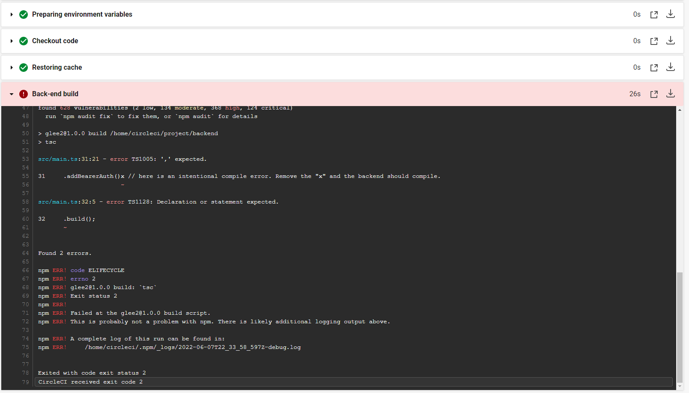
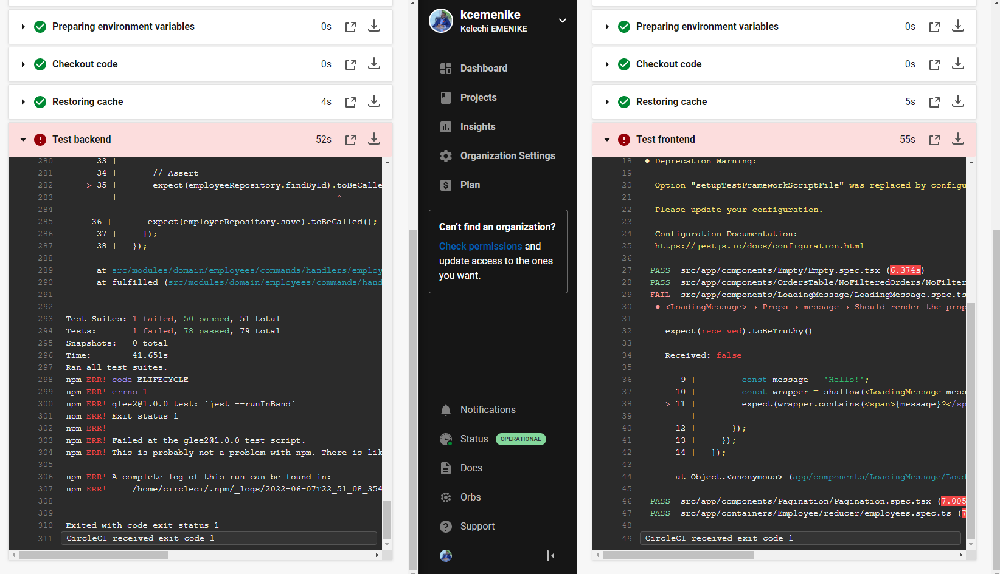
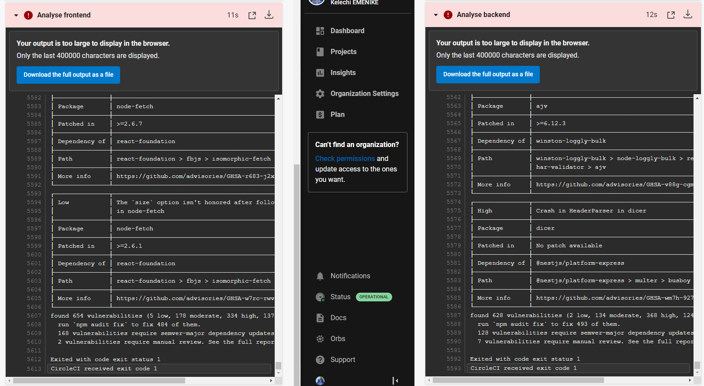
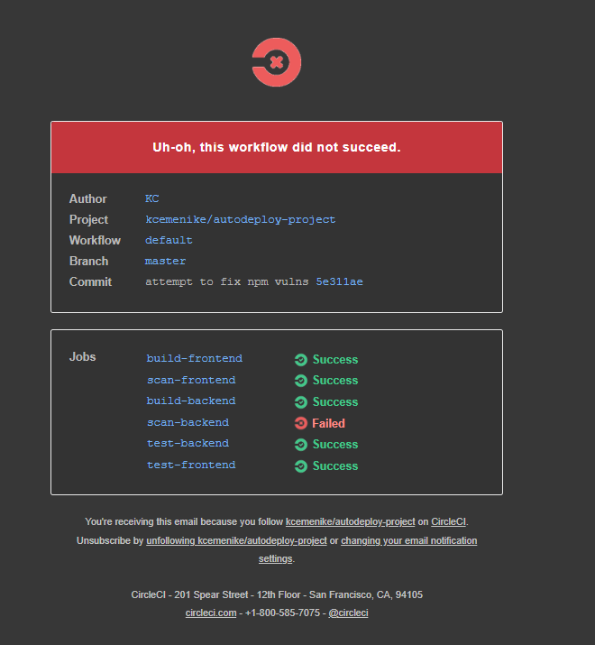
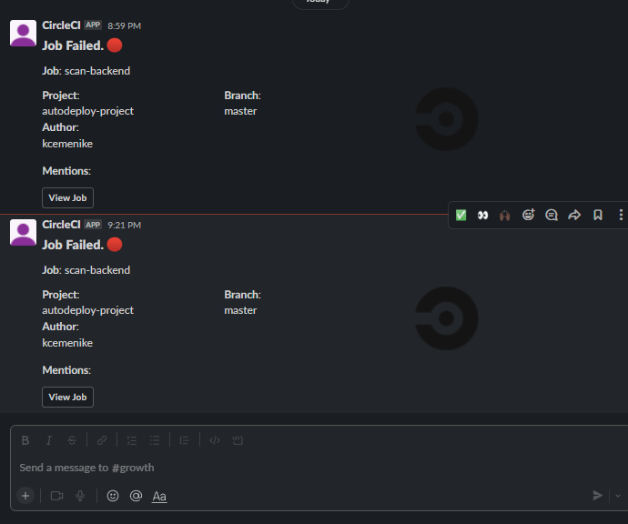
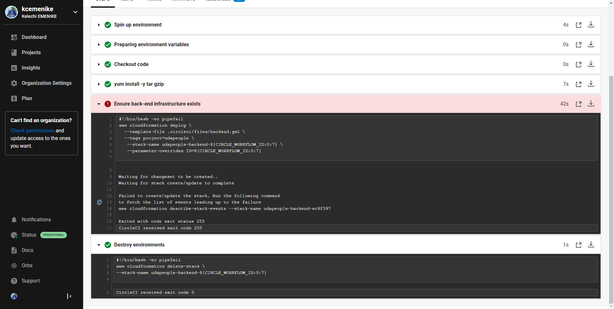

URL01 (Git repo): `https://github.com/kcemenike/autodeploy-project`  
URL02 (S3 bucket)  
URL03 (CloudFront Frontend URL - blue): `d1nxo3y2x3utjz.cloudfront.net`  
URL04 (deployed application backend in EC2):  
URL05 (Prometheus server):  

SCREENSHOT01 (job failed because of compile errors):   
SCREENSHOT02 (job failed because of unit tests):   
SCREENSHOT03 (job failed because of vulnerable packages):   
SCREENSHOT04 (Alert from failed build):   :   
SCREENSHOT05 (Infrastructure creation job failure):   
SCREENSHOT06 (Smoke test job failure)
SCREENSHOT07 (Failed smoke test rollback)
SCREENSHOT08 (Promotion job success)
SCREENSHOT09 (Cleanup job success)
SCREENSHOT10 (Deploy filtered to master branch only)
SCREENSHOT11 (Graph of EC2 instance including available mem, disk space and CPU usage)
SCREENSHOT12 (Screenshot of alert sent by Prometheus)